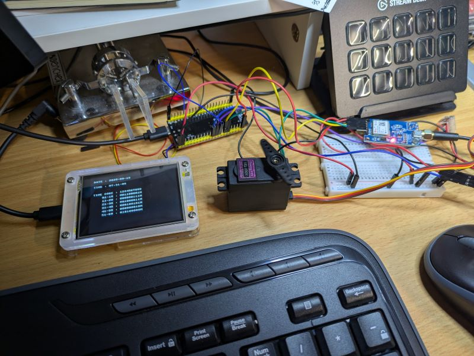
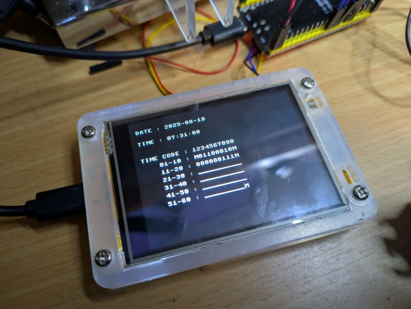
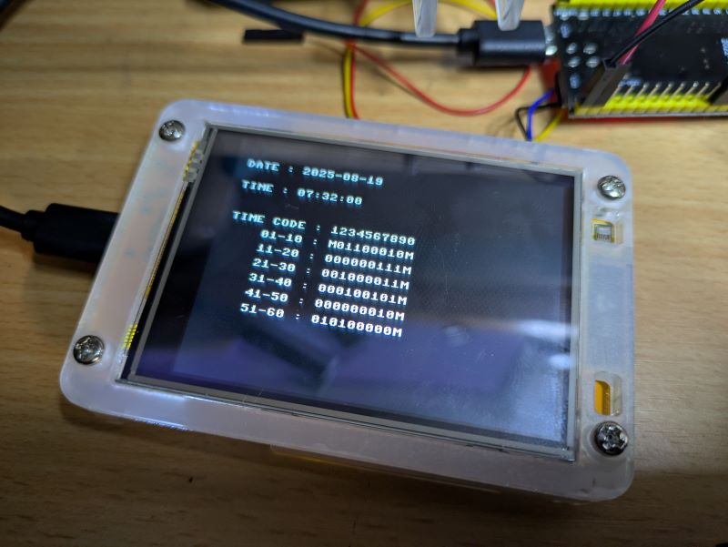
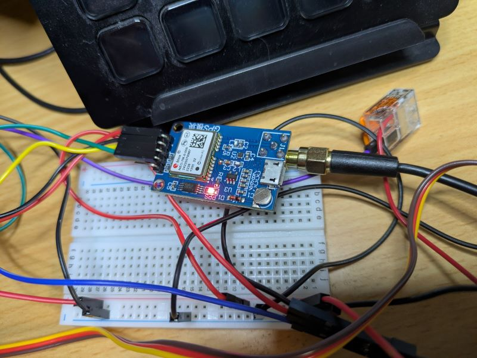
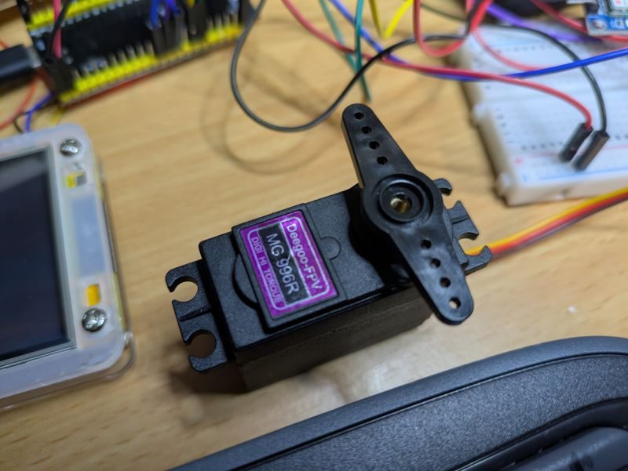

# OCD Trigger Clock

## Table of Contents

- [OCD Trigger Clock](#ocd-trigger-clock)
  - [Table of Contents](#table-of-contents)
  - [About ](#about-)
    - [Project Goals](#project-goals)
    - [Things left to do](#things-left-to-do)
  - [So Let's See This Thing](#so-lets-see-this-thing)
    - [The Project](#the-project)
    - [The Clock](#the-clock)
    - [Other Parts](#other-parts)
  - [How Does It Work?](#how-does-it-work)
    - [Sending the Signal](#sending-the-signal)
    - [There are Problems](#there-are-problems)
    - [What time do we start?](#what-time-do-we-start)
    - [This seems a little off...and it's getting worse...](#this-seems-a-little-offand-its-getting-worse)
    - [There are also Solutions](#there-are-also-solutions)
      - [Building the Data Frame](#building-the-data-frame)
      - [Mapping the Distribution](#mapping-the-distribution)
      - [Adjusting for Bit Skew](#adjusting-for-bit-skew)
    - [Conclusions](#conclusions)
      - [Things I wish I would have done](#things-i-wish-i-would-have-done)
      - [Things I wish I would NOT have done](#things-i-wish-i-would-not-have-done)
      - [Things I'll probably still do](#things-ill-probably-still-do)
  - [Getting Started ](#getting-started-)
    - [Prerequisites](#prerequisites)
    - [Installing](#installing)
  - [Usage ](#usage-)
  - [Sample Output](#sample-output)
  - [Controller](#controller)
  - [Clock](#clock)

## About <a name = "about"></a>

The Ostentatious Chronometric Device Trigger is a nod to precision timekeeping done in a way that is somehow simultaneously over-engineered AND under-engineered. 

This project was inspired by the [Metronalmost](https://hackaday.io/project/203433-metronalmost) project done by [Mike Coats](https://hackaday.io/MikeCoats). I found his submission to the [Hackaday One Hertz Challenge Contest](https://hackaday.io/contest/203248-one-hertz-challenge) to be delightfully irritating and oddly interesting. I particularly liked the idea that you could use a mapping of values across a distribution as the basis for skewing the randomness to accuracy over time. It also demanded that I create something to 'fix' it.

### Project Goals
- Preserve the spirit of the Metronalmost constraint "This device, by design, will never, ever, tick exactly once per second"
- Provide an accurate time reference to help the Metronalmost tick as close to once per second, but never exactly.
- Use the Metronalmost as a synchronization signal to accurately set the time on a clock.

### Things left to do
- Build a case
- Wire things properly
- Battery power
- Better write up, docs, and video
- Code cleanup
- Fix the many bugs created intentionally and otherwise
- Apply ML to find better distribution mapping functions

## So Let's See This Thing

### The Project



### The Clock

Receiving the time code


With a complete data frame


### Other Parts






## How Does It Work?
Thankfully, we are constantly being bombarded by RFI that gives us nanosecond accurate time and date information. There are plenty of options for GPS disciplined oscillators, but a GPS disciplined metronome would be absurd. So let's make one...

A GPS module can pick up the satellite signals that will give us the current date and time. Using this, we can set the time on the metronome controller accurately as a basis for our clock signal. Many of the GPS modules can also provide a highly accurate PPS (Pulse Per Second) signal that could be used to very accurately drive the metronome. That is beside the point...

What we can do is use the GPS messages and the PPS signal to determine when any given minute starts. This is the basis for the data that we want send to the clock. We can now create a 60 bit [IRIG-H timecode](https://en.wikipedia.org/wiki/IRIG_timecode), in the style of radio station [WWVB](https://en.wikipedia.org/wiki/WWVB), which can be sent to to any receiver that requires synchronization. Just to demonstrate the this is not just some wibbly wobbly, timey wimey whimsy, we can throw in things like Daylight Savings Time, error correction, and date and still have some bits left over for flavor.

### Sending the Signal
Drawing the rest of the owl will require that we find a way to use the almost once per second ticks of the metronome as a carrier for the 60 bits of data we need to send each minute. But first, let's talk about how we propagate the signal. In the interest of time, I'm just going to hard wire a connection between the metronome and the clock. The signal will be indicated by a HIGH output for the same duration of time of each tick of the metronome. The clock can measure the duration of each pulse to determine what is being sent. Future versions for the project will include as many signaling options as possible so we can share our time with as many devices as we can dream up. 

- ISM band
- Audio
- Infrared
- Ultrasonic
- Physical triggers

So now that we know the date and time (thanks, GPS!), we have to figure out how to get our time code modulated over the tell-tale heartbeat of the metronome. Since we're never ticking at exactly once per second, we can break the ticks into less than one second and more than one second. With that, we can manipulate each sequence of 60 ticks such that we can send our time code. There are a few problems with this that we need to solve...

Now that we've got all that on the table, we can create our sixty bit time code, use our distribution mapping to create sixty less than/greater than one second pulses, trigger the servo for the metronome, and send our signal across the wire.

The clock itself is as straightforward as the rest of this project. We receive the signal, detect the data frame, decode the data, and set the clock. Everything is amazingly complete, consistent, and well documented across the ESP32, MicroPython, and CYD (Cheap Yellow Display) ecosystem so what could possibly go wrong?

### There are Problems

### What time do we start?
If we don't put our time code in some kind of data frame, it will just look like a series of ones and zeroes and can not be interpreted. To get around this, the time code uses a third signal as a MARK between segments of data. A full 60 bit frame contains a total of seven MARKs. It starts with a MARK and ends with a MARK. There is also a MARK every 10 seconds, which makes it horribly inconvenient for encoding and decoding the signal because you have to account for MARK in the middle of some bytes you are trying to read for a given data point.

### This seems a little off...and it's getting worse...
The second issue is that one of the project constraints indicates that the swinging of the metronome should average out to one beat per second over time. Because there are reserved bits that are always ZERO and with the nature of the BCD number encodings with dropped bits, there will be a skew to one side of our greater than/less than one second ticks. 

### There are also Solutions

#### Building the Data Frame

Adding a MARK signal is easy enough. We know that a zero is going to be less than 1.0 seconds and a one is going to be greater than 1.0 seconds. Setting min/max values for zero and one bits allows us to set a pulse duration for mark bits that is less than the lowest zero or higher than the highest one. Since these pulses are going to be on the extreme edges of or distribution, they will skill the over all 60 second timeframe for our code. This should probably be fixed at some point. Following the lead from WWVB's time code, a data frame starts and ends with a MARK, signaling the receiver that a new data frame is starting.

#### Mapping the Distribution

**Disclaimer**: I am not good at statistics, probabilities or math. Most of this work is probably incorrect. I would love for people to riff on this and come up with some better mapping techniques.

Zero, one, and mark pulse durations are selected randomly from a mapped distribution file.  This distribution mapping can be created any way you'd like. If you want them to be as close to 1.0 seconds as possible, tighten it up. If you want it to be as far away as possible, you can do that to. Some sample code has been provided to test some randomly generated mappings.

To generate a series of mappings and pick the 'best' one, you can use [generate_mappings.py](mapping/generate_mappings.py). This will create a series of 'test.csv' mapping files and copy the best one to 'test_best.csv'.  You can replace the mappings.csv file with any mapping of your choosing.
```
cd mappings
python generate_mappings.py
```

Sample Output
```
Generating mapping with 100 entries, mean 0.8500000000000002, 85.00000000000001% above mean
Writing mapping to 'test.csv'

Generated 100 entries in the mapping.
Length: 100
Mean: 0.76
Percentage above mean: 81.00%
Testing mapping with 999 iterations
Total Time:  59008.47 Average Time: 59.07 / 999 iterations
Test 256, Mean: 0.85, Above: 0.85, Avg Time: 59.07

Total Tests: 256, Best Mean: 0.45, Best Above: 0.70, Best Avg Time: 60.55
```


#### Adjusting for Bit Skew

Each sixty bit time code will have it's own skew toward zero or one values. To adjust for this, we keep track of what has been sent and how far away our average pulses are from 1.0 second. This allows us to pick better random numbers and adjust them in a way that gets us closer to 1.0 on average. 

### Conclusions

We took the time and date from a GPS signal and used a metronome to synchronize a clock.

#### Things I wish I would have done
- I would have started sooner, but I didn't have an accurate clock
- Spent more time learning MicroPython to reduce the overall learning curve of working on the ESP32 and CYD
- Learned esptool more quickly to help with development workflow
 
#### Things I wish I would NOT have done
- Forgotten how statistics work, especially probability distributions
- Applied 5V to the VCC pin of the first GPS module (RIP). It is powered by 3.3V, but if you are powering via 5V USB, it steps it down for you. There is no protection on the VCC pin.

#### Things I'll probably still do
- Add more signal output options. There are so many ways to send and receive data. This system should do all of them, just in case...
- Make a better case.
- Add ticking sounds
- Add touch controls to the clock to enable/disable the servo and sound. It could also reset the clock for demos
- Add more info from the GPS data to the display


## Getting Started <a name = "getting_started"></a>

You'll need some hardware:
- CYD (Cheap Yellow Display) for the clock
- ESP32 of some variety for the controller
- A GPS module
- A servo to swing the metronome
- A way to power it all
- Some misc wires and things to make it look pretty

### Prerequisites

- You'll need to flash MicroPython on the CYD and ESP32. Best of luck.
- You'll need to know some python

### Installing

You will need to change the source for the controller and the clock to reflect the pins you use fo the GPS module and servo.

Controller
- Copy the files in controller/src to the ESP32 allocated for the controller

Clock
- Copy the files in clock/src to the CYD allocated for the clock

## Usage <a name = "usage"></a>

- Turn it on
- If it catches fire you will need to stop what you are doing and extinguish the fie
- Repeat until you see the servo move and the clock display update the time

## Sample Output

## Controller

Here is an example of the serial output of the controller
```
Sending 0: 0.8187668 us
Time: 2025-8-19  7:33:49.0  skew == -7.78231
Sending bit 58: 0
Sending 0: 0.7615986 us
Time: 2025-8-19  7:33:49.0  skew == -8.020714
Sending bit 59: 2
Sending 2: 0.3 us
Time: 2025-8-19  7:33:49.0  skew == -9.020714
Satellite Data:
    In Use: 11, Visible: [30, 1, 2, 3, 24, 22, 6, 46, 48],  Used: [14, 17, 22, 1, 46, 30, 19, 2, 6, 3, 24]
    Fix: 3, HDOP: 0.84, VDOP: 1.07, PDOP: 1.36
    Latitude: 42° 45.22403' N, Longitude: 85° 47.90342' W, Altitude: 209.1
    Speed: 0.25002 km/h, Course: 0.0, GEOID Height: -34.4
Date: (19, 8, 25), Time: [7, 33, 49.0]
UTC Timestamp: [7, 33, 49.0], UTC Offset: 0
Time: 2025-8-19  7:33:49.0
DEBUG: Day 2025-8-19 == 001000110001 == 001000110001
DEBUG: _set_days_bits(2025-8-19)
Current datetime: None
Day of the year: 231
DEBUG: Day 2025-8-19 == 001000110001 == 001000110001
Sending Timecode: 201100011200000011120010000112000100101200000001020101000002
Sending bit 0: 2
Sending 2: 0.3 us
Time: 2025-8-19  7:33:49.0  skew == -1
Sending bit 1: 0
Sending 0: 0.88125 us
Time: 2025-8-19  7:34:8.0  skew == -1.11875
```

## Clock

Here is an example of the serial output of the clock
```
[57] Data[57]: 0  (818791 us)
Data: 2025-08-19 07:31:00 M01100010M000000111M001000011M000100101M000000010M_________M (!update/part)
[58] Data[58]: 0  (761626 us)
Data: 2025-08-19 07:31:00 M01100010M000000111M001000011M000100101M000000010M_________M (!update/part)
[59] Data[59]: MARK (300040 us)
Found M data frame marker
Updating screen...
Data: 2025-08-19 07:31:00 M01100010M000000111M001000011M000100101M000000010M010100000M (update)
Drawing screen...
[60] Data[00]: MARK (300047 us)
Found MM data frame marker
Ticks: 0
[01] Data[01]: 0  (881273 us)
Updating screen...
Data: 2025-08-19 07:32:00 M01100010M000000111M001000011M000100101M000000010M010100000M (update)
Drawing screen...
[02] Data[02]: 1  (1139376 us)
Data: 2025-08-19 07:32:00 M01100010M000000111M001000011M000100101M000000010M010100000M (!update)
[03] Data[03]: 1  (1052432 us)
```

